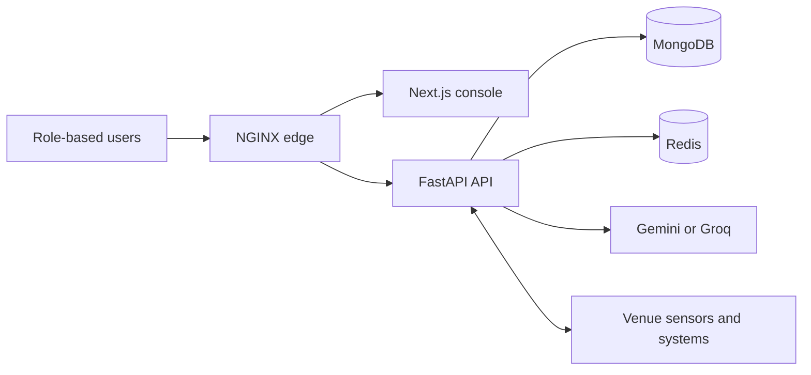
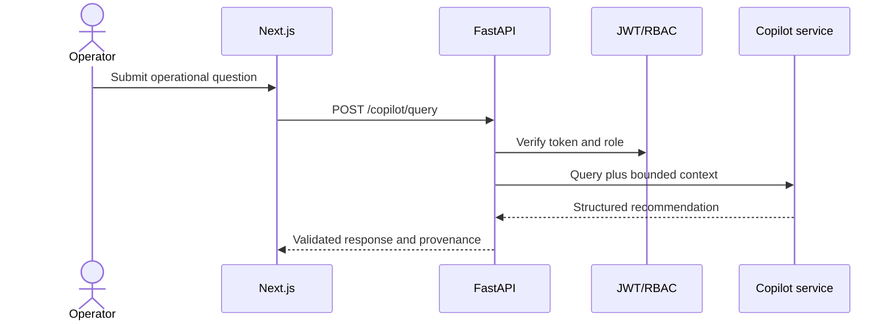
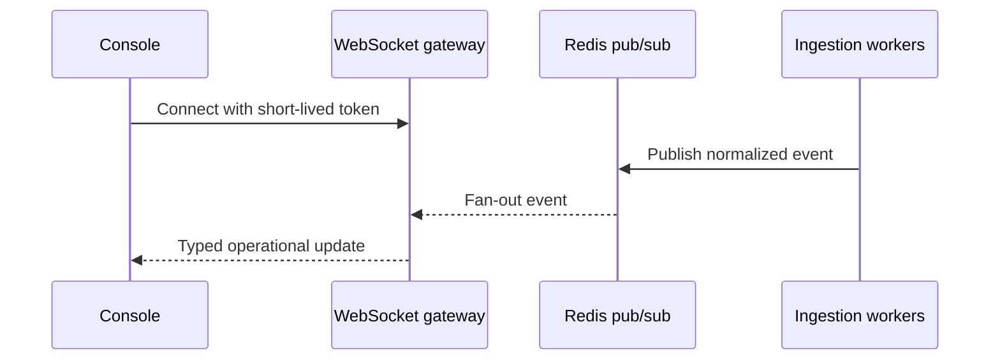
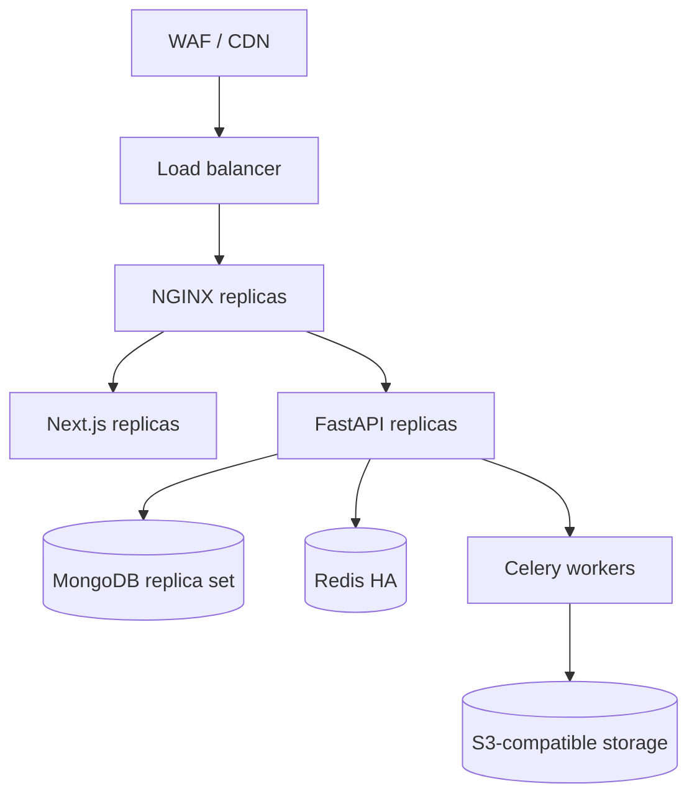

# 🏗️ ArenaMind Architecture

## System architecture

The current repository is a modular monolith, deliberately chosen to keep incident transactions consistent while leaving service boundaries explicit. High-volume ingestion and AI workloads can be extracted behind the same contracts.

## Frontend architecture

App Router owns routing and server metadata. React Query owns remote state. Feature components consume typed API boundaries; presentation remains independent of transport. CSS variables form the token layer and media queries cover handheld, workstation, and wide command displays.

## Backend architecture

FastAPI routes validate schemas and authorize principals. Services contain use-case logic. Repository adapters own persistence. Provider adapters isolate LLM and venue integrations. Pydantic validates every boundary.

## Authentication and request lifecycle

NGINX applies edge controls. FastAPI validates the bearer token, constructs a typed principal, enforces endpoint roles, validates input, invokes a service, validates output, and emits structured telemetry. Production replaces bootstrap authentication with OIDC while preserving principal claims.

## Data model

Core production documents are User, Venue, Zone, Sensor, Metric, Incident, Assignment, Shift, TransportStatus, SustainabilityReading, Conversation, CopilotDecision, and AuditEvent. Incident and AuditEvent are append-oriented; high-volume metrics use MongoDB time-series collections and lifecycle policies.

## WebSocket workflow

## Security architecture

Trust boundaries exist at the edge, identity layer, API schemas, repositories, and AI provider. Least privilege applies by role and venue. Audit events must capture incident and recommendation decisions. Secrets remain outside images. AI context is minimized and prompt output is schema-constrained.

## Caching and scalability

Redis stores short-lived dashboard aggregates, rate-limit counters, and pub/sub events. MongoDB replica-set secondaries can serve approved analytical reads. Celery workers isolate reports, embeddings, and summarization. Stateless web/API replicas scale horizontally behind the edge. Metric collections use time-series bucketing and retention policies.

## Deployment

## 📖 Related guides

- [Gemini, Groq & MongoDB Setup](AI_PROVIDER_MONGODB_SETUP.md)
- [MongoDB Data Architecture](DATABASE.md)
- [Security Policy](SECURITY.md)
- [Deployment Guide](DEPLOYMENT.md)
