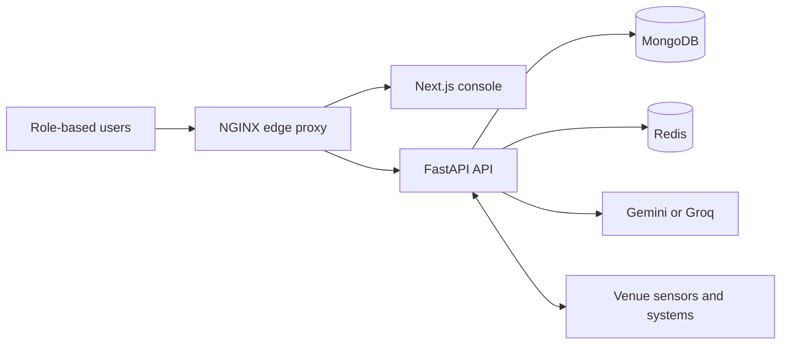
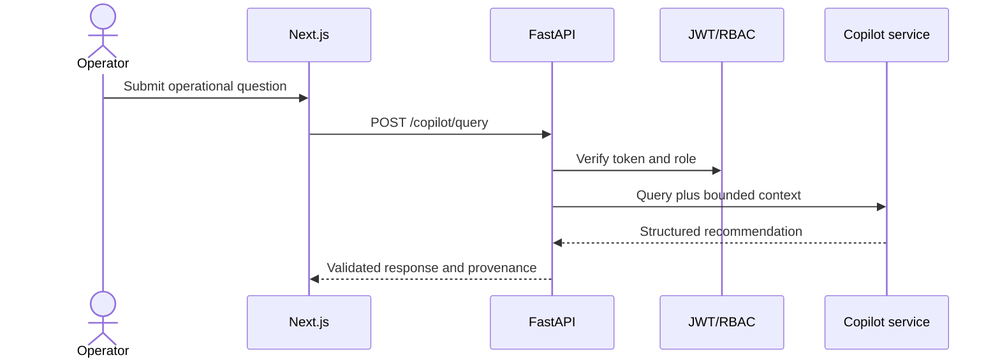
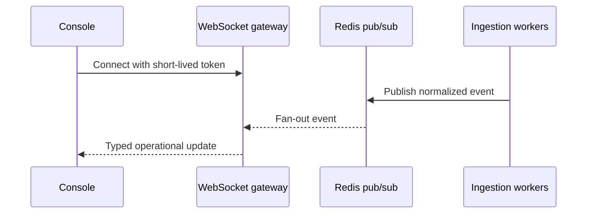
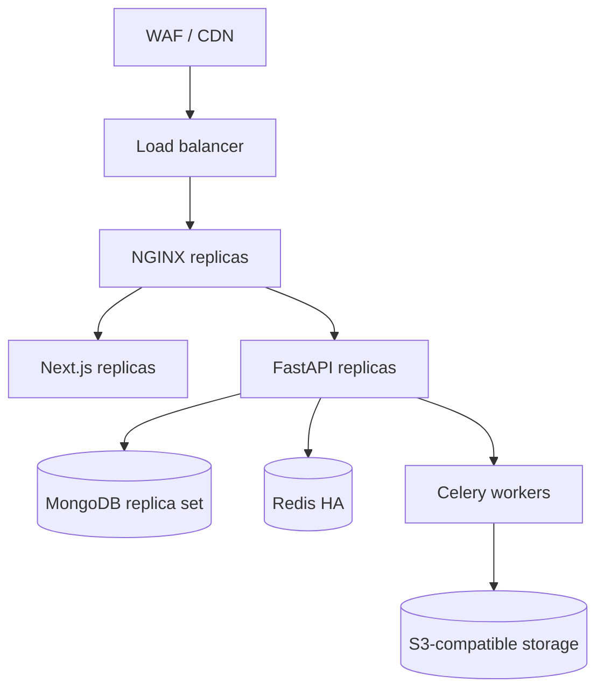

---

### 🧭 Navigation Panel

    

---

This document outlines the system, database, security, and integration architecture for the ArenaMind AI platform.

---

## 🗺️ System Topology

ArenaMind AI is configured as a modular monorepo, separating the Next.js presentation layers from the FastAPI business logic while maintaining strict API contracts.

---

## ⚡ 1. Backend Service Layer

The FastAPI backend routes validate incoming request schemas using Pydantic contracts and enforce security checks via the JWT/RBAC dependency layer before invoking the appropriate domain services.

---

## 📡 2. Real-Time WebSocket Workflows

Live operational metrics and active incident alerts are streamed in real time to all signed-in dashboards via Redis pub/sub.

---

## 🍃 3. Data Architecture

- **Primary Database**: MongoDB serves as the persistent system of record. High-importance collections (such as `users`, `incidents`, `assignments`, `audit_events`) use indexed queries for O(1) retrieval.
- **Cache Store**: Redis acts as an in-memory key-value store cache for roles and dashboard views with automatic expiration (TTL), as well as serving pub/sub channels.

---

## 🚀 4. Production Deployment Topology

The stateless Next.js web application and FastAPI backend containers are replicated horizontally behind edge load balancers, storing persistent assets in managed cloud databases.

