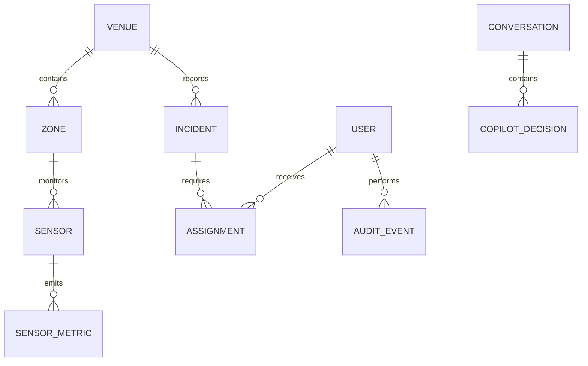

# 🍃 MongoDB Data Architecture

ArenaMind uses MongoDB for operational documents whose schemas evolve as venue integrations mature. Pydantic remains the authoritative application boundary: flexible storage does not mean unvalidated data.

## 🗂️ Core collections

| Collection | Responsibility | Retention |
|---|---|---|
| `incidents` | Security, medical, crowd, fire, and transport incidents | Tournament policy; archive before deletion |
| `audit_events` | Immutable security and operational decisions | Compliance policy |
| `sensor_metrics` | Time-series normalized venue observations | Hot window, then object storage |
| `assignments` | Responder and volunteer work allocation | Tournament plus review window |
| `conversations` | Minimal Copilot session metadata | Short-lived, consent-aware |
| `copilot_decisions` | Structured recommendations and provenance | Audit policy |

## 📄 Incident document

```json
{
  "id": "018f...",
  "title": "North Plaza crowd threshold exceeded",
  "category": "crowd",
  "severity": "critical",
  "zone": "N-04",
  "description": "Sustained threshold breach across validated sensors.",
  "status": "open",
  "created_at": "2026-07-15T13:54:00Z"
}
```

The application excludes MongoDB’s internal `_id` from public responses and exposes a provider-neutral string `id`.

## 🔎 Indexes

- `{ created_at: -1 }` supports the newest-first incident feed.
- `{ status: 1, severity: 1 }` supports active risk filtering.
- Production sensor time-series collections should use `{ sensor_id: 1, observed_at: -1 }` plus TTL/archive policy.
- Audit queries should use `{ venue_id: 1, created_at: -1 }`.

Every index must correspond to an observed query. Use `explain("executionStats")` before adding compound indexes and watch write amplification.

## 🔗 Relationships



Use references for independently changing or high-cardinality entities. Embed bounded snapshots when historical accuracy matters, such as responder display name and zone label at assignment time.

## 🛡️ Integrity and operations

MongoDB schema validation should mirror Pydantic rules in production. Use majority write concern for incidents and audit events, replica sets across failure domains, encryption in transit/at rest, least-privilege users, continuous backups, and rehearsed point-in-time restores. Never store raw AI keys, JWTs, biometric templates, or unnecessary spectator identity in documents.

See [AI_PROVIDER_MONGODB_SETUP.md](AI_PROVIDER_MONGODB_SETUP.md) for local and Atlas configuration.
