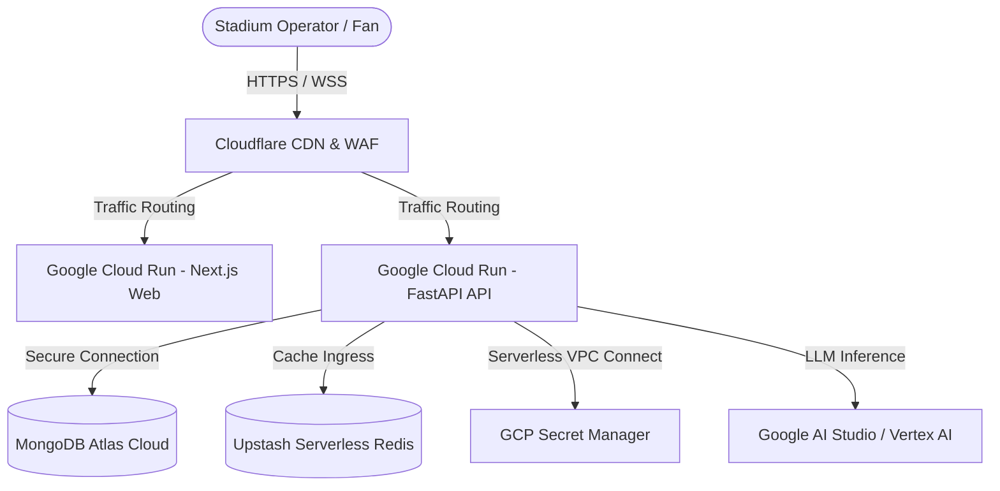

<div align="center">


</div>

---

<div align="center">

### 🧭 Navigation Panel

[](README.md) [](ARCHITECTURE.md) [](DEPLOYMENT.md) [](SECURITY.md) [](INSTRUCTIONS.md)

</div>

This document provides step-by-step instructions for running ArenaMind AI on your local machine (`localhost`) and outlines production-grade deployment architectures across cloud environments.

---

## 💻 Part 1: Local Host Setup Guide

ArenaMind AI can be run locally using **Docker Compose** (recommended for speed and consistency) or **manually** (best for active frontend/backend development).

### 📋 1. Prerequisites

Before you begin, ensure you have the following installed:

- **Git** (for version control)
- **Docker Desktop** (required for Docker setup)
- **Node.js 22+ & npm** (required for manual frontend setup)
- **Python 3.12+** (required for manual backend setup)
- **Gemini API Key** (from Google AI Studio) OR **Groq API Key** (from GroqCloud Console)

---

### 🐳 Option A: Running with Docker Compose (Recommended)

This method starts all four services (MongoDB, Redis, FastAPI Backend, Next.js Frontend) and configures them to communicate securely through a private container network.

#### Step 1: Clone the repository and configure the environment

1. Copy the `.env.example` file to create your local `.env`:

   ```bash
   cp .env.example .env
   ```

2. Open `.env` and fill in your AI provider credentials. E.g., for Gemini:

   ```dotenv
   AI_PROVIDER=gemini
   AI_API_KEY=your_gemini_api_key_here
   AI_MODEL=gemini-2.5-flash
   ```

#### Step 2: Start the containers

Run the following command to build and launch all services in detached mode:

```bash
docker compose up --build -d
```

#### Step 3: Verify execution and port access

Once the command completes, verify that all services are healthy and running:

```bash
docker compose ps
```

The services are exposed on the following ports:

- 🌐 **Nginx Reverse Proxy / App Ingress**: [http://localhost:8080](http://localhost:8080) (Access the web dashboard here)
- 🖥️ **Next.js Frontend (direct)**: [http://localhost:3000](http://localhost:3000)
- ⚡ **FastAPI Backend (direct)**: [http://localhost:8000](http://localhost:8000)
- 🍃 **MongoDB**: `localhost:27017`
- 🔴 **Redis**: `localhost:6379`

#### Step 4: Verify health checks

Check the FastAPI backend liveness and readiness probes:

```bash
curl http://localhost:8080/health
curl http://localhost:8080/ready
```

---

### 🛠️ Option B: Manual Setup (No Docker)

Use this option to run the services directly on your host machine to allow fast hot-reloading.

#### Step 1: Configure the Local Environment

1. Start the required **MongoDB** (`27017`) and **Redis** (`6379`) database services. You can run them in one of two ways:
   * **Method A (Recommended: Hybrid Setup)**: Use Docker to run only the database containers (keeps your host machine clean and avoids installing Redis on Windows):

     ```bash
     docker compose up -d mongodb redis
     ```

   * **Method B (Native Services)**:
     * **Windows**: Open an **Administrator Command Prompt** and run `net start MongoDB`. Start your local Redis instance (e.g. via WSL by typing `redis-server`).
     * **macOS**: Start services via Homebrew: `brew services start mongodb-community` and `brew services start redis`.
2. Copy the configuration template:

   ```bash
   cp .env.example .env
   ```

3. Update `.env` to point to `localhost` databases instead of the Docker hostnames:

   ```dotenv
   MONGODB_URL=mongodb://localhost:27017
   MONGODB_DATABASE=arenamind
   REDIS_URL=redis://localhost:6379/0
   # Generate a secure key: python -c "import secrets; print(secrets.token_hex(32))"
   JWT_SECRET=replace-with-at-least-32-random-characters
   BOOTSTRAP_ADMIN_EMAIL=administrator@arenamind.local
   # Generate a strong password: python -c "import secrets; print(secrets.token_urlsafe(16))"
   BOOTSTRAP_ADMIN_PASSWORD=replace-with-a-strong-bootstrap-password
   
   AI_PROVIDER=gemini
   AI_API_KEY=your_gemini_api_key
   AI_MODEL=gemini-2.5-flash
   # Next.js Frontend build-time variables (Required for Vercel/production to point to the backend API)
   NEXT_PUBLIC_API_URL=http://localhost:8000/api/v1
   NEXT_PUBLIC_WS_URL=ws://localhost:8000/ws
   ```

#### Step 2: Setup and start the FastAPI Backend

> [!IMPORTANT]
> The backend is written in Python (FastAPI). All commands below **must be run from the backend directory** (`apps/api`), NOT from the root or the web directory.
> If you are currently in `apps/web`, run `cd ../api` first.

1. Navigate to the API folder, create a virtual environment, and install dependencies:

   ```bash
   # Make sure you are in the apps/api folder
   cd apps/api
   
   # Create and activate virtual environment
   python -m venv .venv
   
   # On Windows Git Bash:
   source .venv/Scripts/activate
   # On Windows CMD/PowerShell:
   # .venv\Scripts\activate
   # On macOS/Linux:
   # source .venv/bin/activate
   
   # Install backend packages
   pip install -r requirements.txt
   ```

2. Start the Uvicorn server:

   ```bash
   # Must be run from the apps/api folder with virtual environment active
   uvicorn app.main:app --host 127.0.0.1 --port 8000 --reload
   ```

#### Step 3: Setup and start the Next.js Frontend

> [!IMPORTANT]
> The frontend is written in TypeScript/React (Next.js). All commands below **must be run from the frontend directory** (`apps/web`).

1. Open a new terminal, navigate to the web folder, and install dependencies:

   ```bash
   # Make sure you are in the apps/web folder
   cd apps/web
   
   # Install Node packages
   npm install
   ```

2. Start the Next.js development server:

   ```bash
   npm run dev
   ```

3. Open [http://localhost:3000](http://localhost:3000) in your browser. Sign in using the default admin credentials:
   * **Email**: `administrator@arenamind.local`
   * **Password**:
     * If you copied `.env.example` to `.env` without changes, use: **`replace-with-a-strong-bootstrap-password`**
     * If you did not create a `.env` file (or did not set `BOOTSTRAP_ADMIN_PASSWORD`), use: **`ChangeMe-ArenaMind-2026`**
     * If you generated or specified a custom password, use your custom value.

   > 🎨 **Branding & Theme**: The application's favicon is configured using the [favicon.png](favicon.png) asset, which is dynamically loaded by Next.js from [apps/web/src/app/icon.png](apps/web/src/app/icon.png).

---

## ☁️ Part 2: Production Deployment Guide

For a resilient, low-latency, and highly available deployment suitable for stadium operations, we recommend **Serverless + Managed Databases** over standalone virtual machines.

### 🗺️ Recommended Deployment Architecture (Google Cloud Platform)

Since ArenaMind AI natively utilizes **Google Gemini** as its core GenAI provider, deploying on **Google Cloud Platform (GCP)** offers the best integration, security, and low network latency.



---

### 📦 Service-by-Service Deployment Selection

| Monorepo Component | Best Fit Deployment Option | Why This Fits Best |
| --- | --- | --- |
| 🌐 **Next.js Web Frontend** | **Vercel** _(or Google Cloud Run)_ | **Vercel** provides out-of-the-box global edge CDN, automatic performance optimization, instant previews, and seamless React Query SSR compilation. |
| ⚡ **FastAPI Backend** | **Google Cloud Run** | Containerized serverless that automatically scales compute based on incoming requests (including scaling to 0 to save costs). Fully supports FastAPI async execution and **WebSockets** (`/ws/operations`) with session affinity enabled. |
| 🍃 **MongoDB Store** | **MongoDB Atlas** | Managed database cluster with automatic scaling, backup recovery, encrypted storage, and built-in **Atlas Vector Search** (critical when scaling ArenaMind's playbook retrieval to thousands of documents). |
| 🔴 **Redis Cache** | **Upstash Redis** | Serverless Redis model that handles bursty dashboard cache requests. Scales transparently without requiring virtual machine configurations. |

---

## 🔺 Part 3: Vercel Deployment Guide (Step-by-Step)

Follow these exact steps to import and host the monorepo web frontend on Vercel:

### 1️⃣ Import Project from GitHub

1. Log in to your Vercel Dashboard and click **New Project**.
2. Select **Importing from GitHub** and authorize your account if needed.
3. Locate the repository `<your-github-username>/ArenaMind-AI` and click **Import**.
4. In the configuration, select the branch **`main`**.

### 2️⃣ Configure Project Settings

Configure the project parameters exactly as follows:

| Field | Selection / Value |
| --- | --- |
| **Vercel Team** | `<your-vercel-team>` |
| **Plan Type** | `Hobby` |
| **Project Name** | `arena-mind-ai-web` |
| **Framework Preset** | `Next.js` |
| **Root Directory** | `apps/web` *(Vercel will ask you to choose where you want to create the project; use the slash divider to browse to `apps/web`)* |

### 3️⃣ Configure Build & Development Settings

Toggle the **Build and Development Settings** dropdown and configure:

* **Build Command**: `npm run build` or `next build`
* **Output Directory**: Next.js default (leave as default)
* **Install Command**: `npm install --prefix=../..` *(This is required to resolve packages from the monorepo root)*

### 4️⃣ Set Environment Variables

In the **Environment Variables** section, add your environment settings (e.g. your backend URL, JWT secrets, etc.):

1. Add your key-value pairs (for example, Key: `EXAMPLE_NAME`, Value: `your-value`).
2. Select target environments: **Production and Preview**.
3. Alternatively, you can copy the contents of your local `.env` and paste them directly into the Vercel env fields interface.

Click **Deploy** to trigger the build. Vercel will automatically provision the edge routing, build the Next.js bundle, and provide a secure, live URL for your smart stadium dashboard.

---

## 🟣 Part 4: Render Deployment Guide (FastAPI Backend)

Follow these exact steps to host the FastAPI Python backend on Render, enabling full persistent execution and secure WebSocket broadcast connections:

### 1️⃣ Create a New Web Service
1. Log in to your [Render Dashboard](https://render.com) and click **New** -> **Web Service**.
2. Connect your GitHub repository: `<your-github-username>/ArenaMind-AI`.

### 2️⃣ Configure Web Service Settings
Configure the parameters exactly as follows:

| Field | Selection / Value |
| --- | --- |
| **Name** | `arena-mind-ai-api` |
| **Region** | Select the region closest to your users (or your MongoDB Atlas instance) |
| **Branch** | `main` |
| **Root Directory** | `apps/api` |
| **Runtime** | `Python 3` |
| **Build Command** | `pip install -r requirements.txt` |
| **Start Command** | `python -m uvicorn app.main:app --host 0.0.0.0 --port $PORT` |

### 3️⃣ Add Environment Variables
Click **Advanced** -> **Add Environment Variable** and configure the variables required by the backend:

* **`MONGODB_URL`** = `your_mongodb_atlas_connection_string`
* **`MONGODB_DATABASE`** = `arenamind`
* **`REDIS_URL`** = `your_upstash_redis_connection_string`
* **`JWT_SECRET`** = `your_generated_64_character_jwt_secret`
* **`BOOTSTRAP_ADMIN_EMAIL`** = `administrator@arenamind.local`
* **`BOOTSTRAP_ADMIN_PASSWORD`** = `your_strong_bootstrap_admin_password`
* **`AI_PROVIDER`** = `groq` *(or `gemini`)*
* **`AI_API_KEY`** = `your_api_key_value`
* **`AI_MODEL`** = `llama-3.3-70b-versatile` *(or your gemini model)*

Click **Create Web Service** to launch the backend. Render will deploy the uvicorn server and provide a public URL (e.g. `https://arena-mind-ai-api.onrender.com`).

### 4️⃣ Connect Vercel to the Render Backend
Now that your API is live, update your Vercel project environment variables to route traffic to Render:

1. Open your Vercel Dashboard and navigate to project **`arena-mind-ai-web`** -> **Settings** -> **Environment Variables**.
2. Configure the following keys:
   * **`NEXT_PUBLIC_API_URL`** = `https://arena-mind-ai-api.onrender.com/api/v1`
   * **`NEXT_PUBLIC_WS_URL`** = `wss://arena-mind-ai-api.onrender.com/ws`
3. Save the values.
4. Navigate to the **Deployments** tab on Vercel, click `...` next to the latest build, and select **Redeploy** to compile the Next.js app with the new live URLs.

---

### 🛡️ Production Hardening Checklist

Before launching in a live stadium tournament, complete these security and operations steps:

#### 1. Secret Injection (No Env Files)

Never upload `.env` files to production servers.

- Deploy the database strings, AI API keys, and JWT secrets directly into **GCP Secret Manager** or **Vercel Environment Secrets**.
- Bind those secrets to Google Cloud Run as environment variables at runtime.

##### 🔐 How to Generate a Secure JWT Secret
A JWT secret must be a strong, cryptographically secure random value (at least 32 bytes/256 bits, represented as a hex string). You can generate one instantly using any of the following terminal commands:

* **Using Python** (Runs anywhere Python is installed):
  ```bash
  python -c "import secrets; print(secrets.token_hex(32))"
  ```
* **Using OpenSSL** (Available natively on macOS, Linux, and Windows Git Bash):
  ```bash
  openssl rand -hex 32
  ```
* **Using Node.js** (Runs anywhere Node is installed):
  ```bash
  node -e "console.log(require('crypto').randomBytes(32).toString('hex'))"
  ```

Copy the resulting 64-character hex string and paste it as the value for `JWT_SECRET` in your `.env` file or Vercel/GCP environment variables.

#### 🔐 How to Set or Generate the Bootstrap Admin Password
The bootstrap admin password is used to seed the initial administrator account on database startup. It must be at least 12 characters. You can either write your own strong password of your choice, or generate a cryptographically secure random password using any of the following terminal commands:

* **Using Python** (Runs anywhere Python is installed):
  ```bash
  python -c "import secrets; print(secrets.token_urlsafe(16))"
  ```
* **Using OpenSSL** (Available natively on macOS, Linux, and Windows Git Bash):
  ```bash
  openssl rand -base64 12
  ```
* **Using Node.js** (Runs anywhere Node is installed):
  ```bash
  node -e "console.log(require('crypto').randomBytes(12).toString('base64'))"
  ```

Copy the generated random password and paste it as the value for `BOOTSTRAP_ADMIN_PASSWORD` in your `.env` file or Vercel/GCP environment variables.

#### 2. Network Isolation (VPC)

- Restrict MongoDB Atlas and Upstash Redis access using IP Access Lists or VPC Peering.
- Do not expose MongoDB or Redis to the public internet (`0.0.0.0/0`).

#### 3. SSL/TLS & Reverse Proxy Routing

- Route all traffic through a Web Application Firewall (WAF) such as **Cloudflare** or **Google Cloud Armor** to defend against DDoS attacks and rate-limit malicious traffic.
- Enforce HTTP-to-HTTPS redirection and configure HTTP Strict Transport Security (HSTS).

#### 4. Enable WebSockets on Cloud Run

When deploying the API to Google Cloud Run, make sure to adjust:

- **Maximum concurrency**: 80 or higher (FastAPI handles multiple concurrent connections).
- **Session affinity**: Enabled (required to route WebSocket heartbeat checks back to the correct instance).
- **Timeout**: Set to 3600 seconds to prevent premature WebSocket terminations.

<div align="center">


</div>
