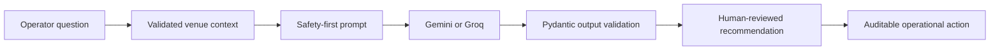

<div align="center">


[](https://git.io/typing-svg)

[](https://nextjs.org/)
[](https://fastapi.tiangolo.com/)
[](https://www.mongodb.com/)
[](https://ai.google.dev/)
[](https://console.groq.com/)
[](LICENSE)

</div>

> 🏟️ **Hack2Skill Virtual PromptWars — Challenge 4: Smart Stadiums & Tournament Operations**

ArenaMind AI is a role-aware decision-support platform for tournament operations centers. It transforms live crowd, incident, medical, transport, workforce, and sustainability context into explainable recommendations while keeping safety-critical decisions under human control.

## 🎯 Challenge vertical

ArenaMind targets **Smart Stadiums & Tournament Operations** for FIFA World Cup 2026-scale venues. The core persona is the **Operations Manager**, supported by specialized views for security, medical, volunteers, transportation, executives, administrators, and fans.

The platform directly addresses the challenge’s high-impact criteria:

| Evaluation area | ArenaMind response |
|---|---|
| Problem alignment | Crowd management, navigation, accessibility, transport, sustainability, multilingual support, and real-time decisions |
| Code quality | Strict TypeScript, typed Pydantic contracts, service/repository boundaries, modular monorepo |
| Security | JWT/RBAC, constrained inputs, trusted hosts, CORS, secure headers, rate limits, non-root containers |
| Efficiency | React Query caching, bounded MongoDB queries, indexed incidents, async APIs, WebSocket updates |
| Testing | API authentication tests, CI build/test gates, documented accessibility and load strategy |
| Accessibility | Semantic HTML, visible focus, non-color status text, reduced motion, mobile layouts, large targets |

## ✨ What it does

- 🤖 **AI Operations Copilot** — reasons over operational context, returns confidence, evidence, assumptions, and ranked actions.
- 📡 **Live Command Dashboard** — crowd pressure, readiness, attendance, incidents, transport, and resources in one scan-friendly view.
- 🚨 **Incident Coordination** — validated, role-gated reporting with indexed MongoDB persistence.
- 🔐 **Production identity boundary** — Argon2 passwords, short-lived access tokens, refresh tokens, administrator provisioning, and explicit RBAC.
- 📚 **Grounded retrieval** — approved playbooks are embedded, stored in MongoDB, ranked for each question, and returned as visible sources.
- 🧭 **Role workspaces** — crowd, security, medical, workforce, transportation, sustainability, administrator, and fan priorities.
- ♿ **Inclusive Operations** — accessible interaction patterns and decision support designed for diverse fans and staff.
- 🚇 **Transport Intelligence** — surfaces service degradation and supports multimodal route decisions.
- 🌱 **Sustainability Signals** — monitors energy, water, waste, and optimization opportunities.
- 🌍 **Provider choice** — use **Groq** or **Google Gemini** through a configurable OpenAI-compatible boundary; no GPT key is required.

## 🧠 Decision logic



The model cannot directly execute stadium actions. It must return a structured summary, reasoning steps, recommendations, confidence score, evidence sources, and provider provenance. When no API key exists, ArenaMind labels its response as `rules-engine`; it never pretends a model produced it.

## 🚀 Quick start

### Prerequisites

- Docker Desktop with Compose
- Node.js 22+ for local frontend development
- Python 3.13+ for local API development
- A Groq or Gemini API key
- Git and a public GitHub account for challenge submission

### Run with Docker

```bash
git clone https://github.com/Babin123456/ArenaMind-AI.git
cd ArenaMind-AI
copy .env.example .env
docker compose up --build
```

Configure `.env` for Groq:

```dotenv
AI_PROVIDER=groq
AI_API_KEY=your-groq-key
AI_MODEL=llama-3.3-70b-versatile
```

Or configure Gemini:

```dotenv
AI_PROVIDER=gemini
AI_API_KEY=your-gemini-key
AI_MODEL=gemini-2.5-flash
```

Open `http://localhost:8080`. API documentation is available at `http://localhost:8080/api/docs`.

> 🔐 Never commit `.env`. Read [Gemini, Groq & MongoDB Setup](AI_PROVIDER_MONGODB_SETUP.md) before deployment.

## 🏗️ Architecture

```text
ArenaMind-AI/
├── apps/web/       Next.js 15 command console
├── apps/api/       FastAPI security, services, MongoDB repository, tests
├── infra/          NGINX reverse proxy and edge controls
├── .github/        Continuous integration
└── *.md            Architecture, API, database, security and operations guides
```

MongoDB is the system of record, Redis supports coordination and live workloads, and NGINX provides the deployment edge. See [Architecture](ARCHITECTURE.md) for system, sequence, WebSocket, AI, security, and deployment diagrams.

## 📚 Documentation

| Guide | Purpose |
|---|---|
| [Architecture](ARCHITECTURE.md) | System boundaries, request flows, scalability, AI and WebSocket design |
| [Gemini, Groq & MongoDB Setup](AI_PROVIDER_MONGODB_SETUP.md) | API keys, provider selection, MongoDB Atlas/local setup, verification and troubleshooting |
| [Environment Configuration](ENVIRONMENT_SETUP.md) | Where every `.env` value comes from, safe secret generation, complete examples, and troubleshooting |
| [API Reference](API.md) | Endpoints, authentication, errors, and Copilot response contract |
| [Database Guide](DATABASE.md) | MongoDB collections, document shapes, indexes, retention, and relationships |
| [Security Policy](SECURITY.md) | Threat model, OWASP mitigations, secrets, AI safety, and vulnerability reporting |
| [Testing Strategy](TESTING.md) | Test pyramid, accessibility, AI evaluation, load checks, and release gates |
| [Deployment Guide](DEPLOYMENT.md) | Docker, NGINX, CI, production rollout, rollback, and recovery |
| [Contributing](CONTRIBUTING.md) | Engineering standards and pull request expectations |
| [MIT License](LICENSE) | Open-source usage terms |
| [96-Point Evidence Matrix](SCORING.md) | Challenge rubric evidence, verification commands, and submission checks |

## 🧪 Validation

```bash
cd apps/api && pytest
cd apps/web && npm test
cd apps/web && npm run build
docker compose config
```

The submission should remain below **10 MB**, public, and on **one branch**. Before submitting, verify `git branch --all`, repository visibility, secret scanning, build status, and the public repository link. Challenge rules allow a maximum of three attempts.

Current automated verification includes **13 backend security/RAG/API tests**, **4 frontend component/accessibility tests**, strict TypeScript production compilation, Compose validation, and a production dependency audit with zero known vulnerabilities at the time of verification.

## 💡 Assumptions

- Sensor and transport feeds are normalized by venue adapters before reaching this repository.
- AI output is advisory and requires authorized human confirmation.
- Production identity uses OIDC/MFA; the included bootstrap login supports local evaluation only.
- Venue-specific maps, response plans, and spectator data remain governed by the venue operator.

## 🛣️ Future scope

Privacy-preserving computer vision, venue digital twins, multilingual voice guidance, offline responder mode, RAG over approved playbooks, tournament-wide multi-venue orchestration, and audited automated playbook proposals.

## 👨‍💻 Author

Developed by **Babin Bid** for **Hack2Skill Virtual PromptWars — Challenge 4**.

- GitHub: [@Babin123456](https://github.com/Babin123456)
- LinkedIn: [babinbid123](https://www.linkedin.com/in/babinbid123)
- Email: [babinbid05@gmail.com](mailto:babinbid05@gmail.com)

## 📄 License

Released under the [MIT License](LICENSE). FIFA names describe the challenge context only; ArenaMind AI is not affiliated with or endorsed by FIFA.

<div align="center">


</div>
