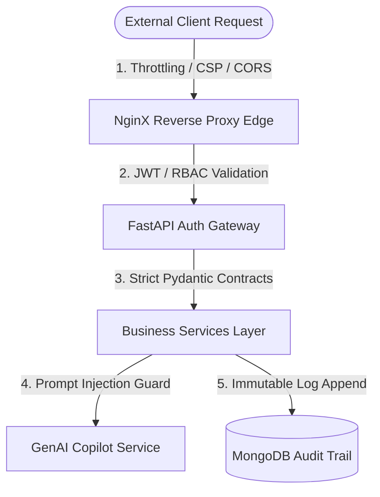

# 🛡️ ArenaMind AI — Security Policy

---
### 🧭 Navigation
[🏠 Home (README)](README.md) | [🏗️ Architecture](ARCHITECTURE.md) | [🚀 Deployment Guide](DEPLOYMENT.md) | [🛡️ Security Policy](SECURITY.md) | [📖 File Instructions](INSTRUCTIONS.md)
---

This document outlines the threat model, mitigation controls, and vulnerability reporting procedures for the ArenaMind AI platform.

---

## 🎛️ Security Threat & Control Flow

This diagram illustrates how ArenaMind intercepts threats at each system layer:

---

## ☣️ 1. Threat Model

ArenaMind operates in high-stakes stadium environments where service availability and data integrity are paramount. The threat landscape includes:
- **Identity Theft**: Compromise of operator accounts to manipulate response actions.
- **Data Tampering**: Malicious modification of active incidents, volunteer tasks, or access routes.
- **Prompt Injection**: Overriding LLM system prompts to extract private system guidelines or generate unsafe instructions.
- **Resource Exhaustion**: Denials of Service (DDoS) aimed at degrading stadium coordination channels during critical match hours.
- **Provider Leakage**: Unintended leaks of venue-sensitive security documents or spectator details to external AI providers.

---

## 🛡️ 2. Mitigation Controls

We implement a multi-layered defense-in-depth model across the entire application stack:

### 🔐 Layer A: Identity & Authorization
- **Strict Role-Based Access Control (RBAC)**: All sensitive routes (e.g. creating incidents, assigning tasks, seeding playbooks) require explicitly verified roles (`require_roles` FastAPI dependency).
- **JWT Lifetime Controls**: Employs short-lived JWT access tokens and long-lived refresh tokens. Access tokens are kept in tab-session storage only.
- **Argon2 Hashing**: Passwords are saved as one-way cryptographically hardened hashes using the Argon2 hashing algorithm.

### 📝 Layer B: Input Safety & AI Safeguards
- **Pydantic Validation**: All request bodies undergo strict validation (regex, length limits, pattern matching) before execution.
- **Injection Rejection**: Incoming copilot queries are screened against known prompt-injection signatures (e.g., `"ignore previous instructions"`) and aborted immediately.
- **Confidence Scoring & Sourcing**: Copilot responses include provenance indicators (source tracking) and require human validation before execution.

### ⚙️ Layer C: Infrastructure Hardening
- **NginX Edge Protection**: Enforces rate limiting (`limit_req`), restricted HTTP verbs, CORS protections, and strict `Content-Security-Policy` headers.
- **Non-Root Containers**: Docker instances run under low-privilege system users (`app`) to block privilege escalation.

---

> [!WARNING]
> **Production Notice**
> The local bootstrap administrator (`administrator@arenamind.local`) is provided for dev/test verification only. A live stadium deployment must bind external identity providers (OIDC/SAML) with Multi-Factor Authentication (MFA) enabled.

---

## 📬 3. Reporting Vulnerabilities

If you identify a security issue, do not open a public GitHub Issue. Report findings privately:

> [!IMPORTANT]
> Email details to: **security@arenamind.io**
> Include the version, target component, detailed reproduction steps, and impact. We commit to acknowledging reports within 24 hours.
